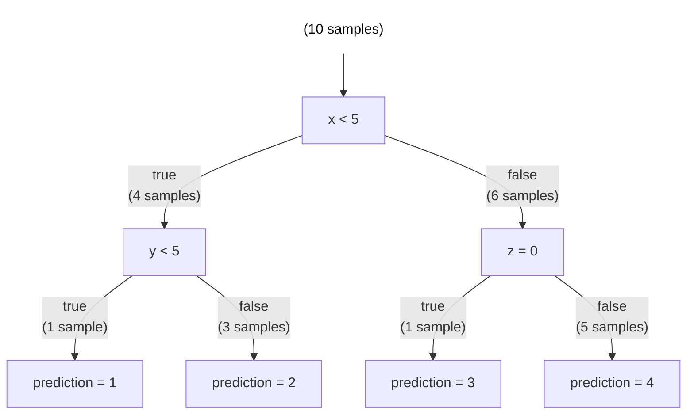

# Game Theory Meets Machine Learning: Interpreting Models with Shapley Values

**Written by: Soroush Saberan**

## Motivation

Features dictate a model's predictions. So if we could know for a given prediction which features and _to what extent_ each feature contributes to a model's predictoion, then we gain valuable insight into both how the model makes its decisions, and why a certain prediction is likely to happen.

Thankfully, such a method exists, and is called SHAP. SHAP values attribute significance to each feature for a given prediction by a model, indicating the extent to which the feature impacts the prediction. In this blog we go over the concept of Shapley values from game theory, explain how they are computed, and explore how Shapley values are extended into SHAP values to interpret machine learning models.

## What are Shapley values?

Shapley values were first introduced as a method in game theory as a way to attribute values to players based on their individual contributions towards a payout within a game-like system. The Shapley value for player $i$ within the set of players $N$ is given by the following formula:

$$
\phi_i(v) = \sum_{S \subseteq N \setminus \set{i}} \frac{|S|!(|N|-|S|-1)!}{|N|!}(v(S \cup \set{i}) - v(S))
$$

Let's break this formula down step by step.

$$\phi_i(v)$$
This is a function that takes a value function $v$ as input, and outputs the Shapley value for player $i$. The value function is a function that takes in any number of players, and outputs what their payout would be.

$$\sum_{S \subseteq N \setminus \set{i}}$$
$S$ is any subset of $N \setminus \set{i}$, and since we are doing the summation operator $\sum_{}$ over all $S$, we are doing the summation over every subset of $N \setminus \set{i}$. Note that order does not matter for sets, meaning that we are considering combinations (as opposed to permutations).

$$\frac{|S|!(|N|-|S|-1)!}{|N|!}$$
$|N|!$ is all possible permutations of $N$. $|S|!(|N|-|S|-1)!$ is all possible permutations of $S$ multiplied by all possible permutations of the remaining players in $N \setminus \set{i}$, which means that $|S|!(|N|-|S|-1)!$ is the number of ways to arrange the players such that the players in $S$ come before player $i$, and the players not in $S$ come after player $i$. So $\frac{|S|!(|N|-|S|-1)!}{|N|!}$ is the proportion of all possible permutations of players in which the players in set $S$ come before player $i$ and the rest come after. This fractional term ensures that each summand is weighted according to its marginal contribution to the total Shapley value.

$$v(S \cup \set{i}) - v(S)$$
$v(S \cup \set{i})$ is the payout if the players in $S$ work with player $i$. $v(S)$ is the payout if the players in $S$ do not work with player $i$. So $v(S \cup \set{i}) - v(S)$ is the value that player $i$ adds to the payout when working with $S$ as opposed to not working with $S$.

Essentially, to calculate the Shapley value for a given player $i$, we consider every possible combination of players not including player $i$, see what happens each time to the payout when we add player $i$ in, and then add up the marginal contributions of all these. Consider the following example:

### Example 1.1

Let the set of players $N$ be $\set{A, B, C}$, and let the value function be defined as follows:

- $v(\set{}) = 0$
- $v(\set{A}) = 1$, $v(\set{B}) = 2$, $v(\set{C}) = 3$
- $v(\set{A, B}) = 4$, $v(\set{A, C}) = 5$, $v(\set{B, C}) = 6$
- $v(\set{A, B, C}) = 10$

To calculate the Shapley value for $A$, we calculate its marginal contribution to each subset:

- $S = \set{}$
  - $\frac{|S|!(|N|-|S|-1)!}{|N|!} (v(\set{A}) - v(\set{})) = (\frac{0!(3-0-1)!}{3!}) (1 - 0) = \frac{2}{6} * 1 = \frac{2}{6} = \frac{1}{3}$
- $S = \set{B}$
  - $\frac{|S|!(|N|-|S|-1)!}{|N|!} (v(\set{A, B}) - v(\set{B})) = \frac{1!(3-1-1)!}{3!} (4 - 2) = \frac{1}{6} * 2 = \frac{2}{6} = \frac{1}{3}$
- $S = \set{C}$
  - $\frac{|S|!(|N|-|S|-1)!}{|N|!} (v(\set{A, C}) - v(\set{C})) = \frac{1!(3-1-1)!}{3!} (5 - 3) =\frac{1}{6} * 2 = \frac{2}{6} = \frac{1}{3}$
- $S = \set{B, C}$
  - $\frac{|S|!(|N|-|S|-1)!}{|N|!} (v(\set{A, B, C}) - v(\set{B, C})) = \frac{2!(3-2-1)!}{3!} (10 - 6) = \frac{2}{6} * 4 = \frac{8}{6} = \frac{4}{3}$

Adding all these up, we get that the Shapley value of $A$ is $\frac{7}{3}$ or $2.\overline{3}$. If you do the same calculation, but for $B$ and $C$, you should get that the Shapley value of $B$ is $3.\overline{3}$ and that the Shapley value of $C$ is about $4.\overline{3}$. This means that overall, player $A$ contributes the least to the payout, and player $C$ contributes the most. Notice that the sum of each player's Shapley value altogether adds up to the same payout when all players contribute to the payout. This is not a coincidence. The sum of Shapley values for all players will always equal the total payout when all players are involved.

## Extending Shapley values to SHAP values for machine learning

We can apply the same concept behind Shapley values, which is used to assign contribution values to individual players in a game, to SHAP values, which is used to assign contribution values to individual features in a model. Consider the following dataset:

| $x$ | $y$ | $z$ |
| --- | --- | --- |
| 10  | 9   | 1   |
| 8   | 10  | 1   |
| 1   | 2   | 1   |
| 3   | 6   | 1   |
| 5   | 3   | 1   |
| 4   | 6   | 0   |
| 6   | 8   | 0   |
| 9   | 4   | 1   |
| 4   | 2   | 0   |
| 8   | 6   | 1   |

And the following tree-based model for this dataset:

To calculate the SHAP values for features $x$, $y$, and $z$, we need to slightly modify our method for Shapley values to work with this tree-based model. Such a method exists and is called TreeSHAP. Here is how TreeSHAP works:

1. Consider a permutation of our features for a specific row.
   - In the above dataset, the permutations of the first row are:
     - $(x=10, y=9, z=1)$
     - $(x=10, z=1, y=9)$
     - $(y=9, x=10, z=1)$
     - $(y=9, z=1, x=10)$
     - $(z=1, x=10, y=9)$
     - $(z=1, y=9, x=10)$
   - For the sake of example, let's consider the permutation $(x=10, y=9, z=1)$.
2. Evaluate the model after adding each feature one at a time in the order of our permutation.
   - For this example, we evaluate the model on $\set{}$, $\set{x=10}$, $\set{x=10, y=9}$, and $\set{x=10, y=9, z=1}$. To do this, we calculate the expected value of the prediction given each set of features as input. In other words, we calculate each of the following:
     - $\mathbb{E}(\text{prediction} | \set{})$
     - $\mathbb{E}(\text{prediction} | \set{x=10})$
     - $\mathbb{E}(\text{prediction} | \set{x=10, y=9})$
     - $\mathbb{E}(\text{prediction} | \set{x=10, y=9, z=1})$
3. Get the marginal contribution of each feature by taking the expected value of the prediction with the given feature, minus the expected value of the prediction without the given feature.
   - So for the permutation in this example:
     - the marginal contribution of $x$ is $\mathbb{E}(\text{prediction} | \set{x=10}) - \mathbb{E}(\text{prediction} | \set{})$
     - the marginal contribution of $y$ is $\mathbb{E}(\text{prediction} | \set{x=10, y=9}) - \mathbb{E}(\text{prediction} | \set{x=10})$
     - the marginal contribution of $z$ is $\mathbb{E}(\text{prediction} | \set{x=10, y=9, z=1}) - \mathbb{E}(\text{prediction} | \set{x=10, y=9})$.
4. Repeat this process for all the remaining permutations of the features. The average marginal contribution of each feature across all of these permutations is then the SHAP value of each feature for this specific row in our dataset.

### Example 2.1

Let's calculate the example above for the permutation $(x=10, y=9, z=1)$:

- $\set{}$
  - To calculate the prediction given by no features, we just take the average prediction given by the model. The model predicts 1 for row 9; 2 for rows 3, 4, and 6; 3 for row 7; and 4 for rows 1, 2, 5, 8, and 10. So the average of all these predictions is $\frac{1*1+2*3+3*1+4*5}{10} = 3$.
- $\set{x=10}$
  - The first node in our model ($x < 5$) evaluates to false. The second node ($z = 0$) evaluates to true for 1 sample, and evaluates to false for 5 samples, so we take the average of these predictions, which is $\frac{1*3+5*4}{6} = 3.8\overline{3}$. So the difference between the prediction with $x$ vs. without $x$ is $3.8\overline{3} - 3 = 0.8\overline{3}$ which means the marginal contribution of feature $x$ (aka, its contribution in this specific permutation) is $0.8\overline{3}$.
- $\set{x=10, y=9}$
  - Since we did not even use $y$ in our last set, adding $y$ will not change anything, so the prediction stays the same at $3.8\overline{3}$. So its marginal contribution for this permutation is $3.8\overline{3} - 3.8\overline{3} = 0$.
- $\set{x=10, y=9, z=1}$
  - Since $z=1$, our model predicts 4. So the marginal contribution of $z$ for this permutation is $4 - 3.8\overline{3} = 0.1\overline{6}$.

So for the permutation $(x=10, y=9, z=1)$:

- $x$ has a marginal contribution of: $0.8\overline{3}$
- $y$ has a marginal contribution of: $0$
- $z$ has a marginal contribution of: $0.1\overline{6}$

### Example 2.2

Let's go through the calculation for the marginal contributions of the permutation $(y=9, z=1, x=10)$, since this one is a little more complicated:

- $\set{}$
  - Just as before, the expected value of the model's prediction on this set is $3$.
- $\set{y=9}$
  - At node $x<5$, we do not know yet what $x$ is, so we calculate the expected value of the prediction: $\frac{4 * (\text{prediction at left node}) + 6 * (\text{prediction at right node})}{10}$. The prediction at the left node is 2, because in our case $y=9$. The prediction at the right node is $\frac{1*3+5*4}{6} = 3.8\overline{3}$, because we do not know $z$ yet. So $\frac{4 * (\text{prediction at left node}) + 6 * (\text{prediction at right node})}{10} = \frac{4 * 2 + 6 * 3.8\overline{3}}{10} = 3.1$. So the marginal contribution of $y$ is $3.1 - 3 = 0.1$.
- $\set{y=9, z=1}$
  - Since now we know $z$, the prediction at the right node from before changes from $3.8\overline{3}$ to $4$. So the expected prediction after adding $z$ is $\frac{4 * 2 + 6 * 4}{10} = 3.2$. And the marginal contribution of $z$ is $3.2 - 3.1 = 0.1$.
- $\set{y=9, z=1, x=10}$
  - Just as before, the prediction given by these values as input to our model is 4. So the marginal contribution of $x$ is $4 - 3.2 = 0.8$.

So for the permutation $(y=9, z=1, x=10)$:

- $x$ has a marginal contribution of: $0.8$
- $y$ has a marginal contribution of: $0.1$
- $z$ has a marginal contribution of: $0.1$

If you calculate the marginal contributions of each feature for the remaining permutations, you should get:

- $(x=10, z=1, y=9)$
  - $x$ has a marginal contribution of: $0.8\overline{3}$
  - $y$ has a marginal contribution of: $0$
  - $z$ has a marginal contribution of: $0.1\overline{6}$
- $(y=9, x=10, z=1)$
  - $x$ has a marginal contribution of: $0.7\overline{3}$
  - $y$ has a marginal contribution of: $0.1$
  - $z$ has a marginal contribution of: $0.1\overline{6}$
- $(z=1, x=10, y=9)$
  - $x$ has a marginal contribution of: $0.9$
  - $y$ has a marginal contribution of: $0$
  - $z$ has a marginal contribution of: $0.1$
- $(z=1, y=9, x=10)$
  - $x$ has a marginal contribution of: $0.8$
  - $y$ has a marginal contribution of: $0.1$
  - $z$ has a marginal contribution of: $0.1$

Notice that the sum of marginal contributions for each permutation always adds up to $1$. This is not a coincidence. This has to do with the fact that the average prediction given by our model is $3$, yet the prediction given by our model for this specific row is $4$, which is $1$ more than $3$.

Finally, to get the SHAP values of $x$, $y$, and $z$ (for this specific row in our dataset), we just take the average marginal contribution of $x$, $y$, and $z$:

- SHAP value of $x = \frac{0.8\overline{3}+0.8+0.8\overline{3}+0.7\overline{3}+0.9+0.8}{6} = 0.81\overline{6}$
- SHAP value of $y = \frac{0+0.1+0+0.1+0+0.1}{6} = 0.05$
- SHAP value of $z = \frac{0.1\overline{6}+0.1+0.1\overline{6}+0.1\overline{6}+0.1+0.1}{6} = 0.1\overline{3}$

And again, notice that the sum of each feature's SHAP value adds up to the difference bewteen the prediction on these features, and the average prediction.

From these values we can conclude that for this specific row in our dataset, $x$ has by far the most significant influence on the prediction, $z$ has the second most significant influence on the prediction, and $y$ has the least significant influence on the prediction. And if we want to know the overall influence of each feature in our model (and not just for one specific row), we can calculate the SHAP value of each feature for every row in our dataset, and take the average SHAP value of each feature over all the rows. This provides insight into how our model makes its predictions by giving us a numerical indicator of which features are more or less influential.

## Bonus: My implementation of SHAP (and SHAP interactions) in Python

Just in case you were curious about how this would be implemented in code, I have put together a Python implementation that showcases the core concepts
discussed in this blog. This implementation is a practical example of how the mathematical principles of SHAP are translated into a functioning algorithm.
And as an added bonus, I implemented SHAP interactions as well, which is an algorithm that attributes contribution values to pairs of features, rather than
just individual features like in regular SHAP. The code is commented for clarity. You can find it here: https://github.com/ssaberan/shap/blob/master/shap.py

## References

- https://christophm.github.io/interpretable-ml-book/shapley.html
- https://christophm.github.io/interpretable-ml-book/shap.html
- https://medium.com/analytics-vidhya/shap-part-3-tree-shap-3af9bcd7cd9b
- https://arxiv.org/pdf/2109.09847.pdf
